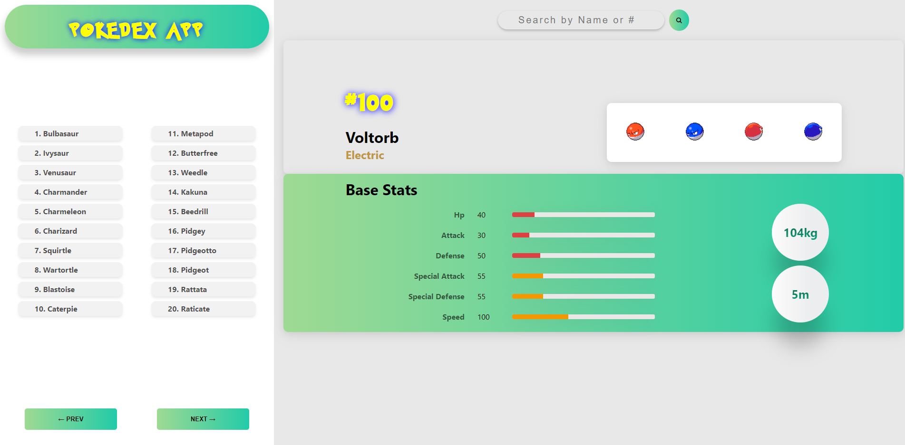

# Pokemon-App
A PokeDex WebApp for Pokémon listing, using PokeAPI with search and details page for each Pokémon

Demo link: <a href= 'https://anantha555.github.io/Pokemon-App/'> Pokémon-App</a>

## Features
- Pokémon data from https://pokeapi.co/  api
---
- a panel to view Pokémon list of 20 size 
- two buttons to navigate between previous/next 20 Pokémon list
---
- search Pokémon using its name or number
---
- a panel to display individual Pokémon information
- information panel has - name , Pokémon types, Pokémon front & back images
- Pokémon types' color depends on its type
- base stats section has HP, Attack, Defence, Special Attack, Special Defense, Speed
  - each stat has its own level bar indicator
  - level bar indicator color can be red, orange, yellow, green depending on its value
  - the weight and height is indicated in kilogram and meter 
---

---

<a href= 'https://www.linkedin.com/in/anantha555/'> LinkedIn </a>

---
